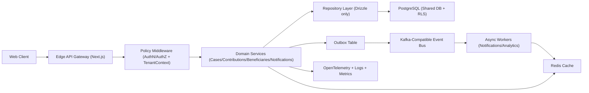

# Enterprise SaaS Transformation Report

## Executive Summary

This codebase is a feature-rich Next.js modular monolith with solid product velocity, but it is not yet enterprise SaaS ready for fintech-grade load and isolation guarantees. The highest-risk issue is the mixed persistence model (Supabase client writes plus Drizzle/direct Postgres reads-writes), which creates transactional ambiguity, inconsistent authorization boundaries, and migration drift.

The target architecture is a shared-database, row-isolated multi-tenant platform with strict layering, typed/versioned API contracts, repository-only data access, and event-driven side effects. The transformation should prioritize safety rails first (rules + tests + migration governance), then move feature domains incrementally.

## Deep Analysis Report

### Current Architecture Style

- Primary style: modular monolith (single deployable Next.js app).
- Runtime: App Router web + API route handlers in one runtime boundary.
- Data layer: mixed Supabase SDK and Drizzle ORM.
- Domain organization: services under `src/lib/services`, route handlers under `src/app/api`.

### Strengths

- `src/lib/utils/api-wrapper.ts` centralizes auth/error/logging concerns.
- `src/lib/utils/api-errors.ts` provides consistent error envelope semantics.
- Strong baseline TypeScript usage and Zod-based env validation (`src/config/env.ts`).
- Rich domain surface already exists (cases, contributions, beneficiaries, notifications, admin RBAC).
- Existing Drizzle schema allows a path to deterministic migration governance.

### Critical Issues

1. Dual write paths (Supabase + Drizzle) violate transactional single-source-of-truth.
2. Permission logic duplicated across wrappers/services can diverge over time.
3. Incomplete migration journal history and out-of-band SQL create drift.
4. Missing enterprise testing baseline (unit/integration/e2e/contract/load/security).
5. No consistent tenant model (`tenant_id` not pervasive across domain tables).

### Hidden Risks

- Silent data integrity drift where application tables exist outside canonical schema definitions.
- Connection pressure from serverless/container scaling without explicit pool strategy.
- Heavy route handlers that blend orchestration, validation, and business logic.
- Potential privilege escalation if route-level checks and service-level checks diverge.

### Technical Debt Classification

- Low: UI consistency debt, naming drift, documentation sync.
- Medium: service size/coupling, repeated wrapper code, route validation inconsistency.
- Critical: multi-tenancy absence, dual persistence model, migration drift, missing test gates.

## Target SaaS Architecture

### Tenancy Model

Shared database with strict row-level isolation:
- Add mandatory `tenant_id` on all tenant-scoped entities.
- Enforce tenant access via RLS and mandatory request-scoped tenant context.
- Keep global/reference data in shared global tables with explicit non-tenant scope.

### Service Boundaries (DDD-Oriented)

- Identity & Access: users, sessions, RBAC, policy engine, tenant membership.
- Case Management: cases, updates, files, status workflows.
- Beneficiary Management: beneficiary profiles, documents, verification.
- Contributions & Sponsorships: donations, recurring plans, approval workflows.
- Notifications: rules, subscriptions, delivery channels, templates.
- Admin Governance: audit, role-permission administration, menu/policy.
- Analytics & Reporting: read-model projections, dashboard aggregations.

### API Gateway Strategy

- Keep Next.js as edge/API gateway initially.
- Introduce strict API layer contracts (`v1`) and centralized policy middleware.
- Move heavy write workflows behind internal service modules, preserving stable API contracts.

### AuthN/AuthZ

- AuthN: Supabase Auth (short-term), then abstraction via `IdentityProvider` interface.
- AuthZ: RBAC + ABAC
  - RBAC for coarse role actions.
  - ABAC for tenant/resource/context checks.
- Mandatory policy check at service boundary, not only route boundary.

### Event-Driven Architecture

- Use Kafka-compatible broker (or managed equivalent) for async workflows:
  - contribution-submitted
  - contribution-approved/rejected
  - case-updated
  - notification-requested
- Outbox pattern required for reliable event publishing from transactional writes.

### Caching Strategy

- L1 in-process cache for stable reference data (TTL + bounded size).
- L2 Redis for hot reads and cross-instance coherence.
- Event-triggered cache invalidation for mutable aggregates.

### Rate Limiting / Throttling

- Gateway-level per-IP + per-user + per-tenant limits.
- Stricter quotas for admin and mutation-heavy endpoints.
- Include idempotency keys for financial mutation endpoints.

### Scalability and Deployment

- Containerized deployment on Kubernetes.
- Horizontal pod autoscaling by CPU + p95 latency + queue depth.
- Read replicas for reporting; primary for writes.
- Edge handles auth/routing/rate-limits; core domain services handle business logic.

### High-Level Architecture Diagram (Textual)



### Data Flow

1. Request enters edge with auth token and tenant context.
2. Policy middleware resolves principal + tenant membership.
3. Controller validates input and calls use-case service.
4. Service executes transaction via repository layer only.
5. Transaction commits state + outbox event.
6. Worker consumes event, performs side effects (notify/cache/projectors).
7. All hops emit trace spans + structured logs with correlation IDs.

## Refactor and Revamp Plan

### Immediate Fixes (Quick Wins)

- Standardize route input/output schemas with Zod in all mutating endpoints.
- Remove duplicated auth/permission logic in wrappers; centralize through one policy guard.
- Add idempotency key middleware for contribution/sponsorship write endpoints.
- Enforce one error envelope for all API routes.

### Structural Refactors

- Introduce domain module layout:
  - `src/modules/{domain}/application`
  - `src/modules/{domain}/domain`
  - `src/modules/{domain}/infrastructure`
- Split large services into focused use cases.
- Add repository interfaces and move all DB access under repositories.
- Introduce `TenantContext` type and mandatory propagation.

### Before vs After Patterns

Before:
- Route calls Supabase client directly and includes business logic.

After:
- Route validates DTO -> invokes use case -> use case calls repository -> repository executes Drizzle transaction.

Before:
- Permission checks in route helper only.

After:
- Route-level fast fail + service-level policy guard + DB-level RLS enforcement.

### Performance Improvements

- Add explicit indexes for high-cardinality predicates and composite filters.
- Replace repeated per-request role queries with scoped cache + invalidation.
- Introduce read-model tables/materialized views for dashboard-heavy analytics.

### Security Hardening

- Mandatory input validation for all endpoints.
- Enforce least-privilege credentials per component.
- Add security regression tests for tenant isolation and privilege boundaries.

## Test Automation Strategy

### Testing Architecture

- Unit: use-case services, policy engine, utility pure functions.
- Integration: route handlers + repositories + ephemeral Postgres.
- Contract: consumer/provider checks for internal API contracts.
- E2E: tenant-scoped critical journeys with seeded fixtures.
- Load: k6 scenarios for contribution/case APIs.
- Security: authz negative tests + dependency scanning + baseline DAST.

### Proposed Folder Structure

```text
tests/
  unit/
    modules/
  integration/
    api/
    repositories/
  contract/
    provider/
    consumer/
  e2e/
    smoke/
    critical/
  load/
  security/
```

### CI/CD Integration

- Required on every PR:
  - lint
  - typecheck
  - unit + integration
  - coverage thresholds
- Nightly:
  - e2e full suite
  - load baseline
  - security scans

### Coverage Thresholds

- Global minimum: 80%
- Critical modules (authz, contributions, financial workflows): 90%
- New code coverage delta gate: >= 90%

## Drizzle Migration and Data Scripts

The implementation artifacts are provided under `drizzle/consolidated/`:
- `schema.ts`
- `migration.sql`
- `seed.ts`

These files establish a single baseline migration strategy and idempotent seed flow. Production-clone introspection SQL is included in comments/runbook guidance to avoid blind assumptions.

## Enterprise Readiness Checklist

- Audit logging is immutable and queryable by actor/tenant/resource.
- Feature flags support tenant-level targeting and safe rollback.
- Config is environment-scoped and validated at startup.
- Secrets use managed secret stores with rotation schedule.
- OpenTelemetry traces/metrics/logs are correlated by request and tenant.
- SLOs defined for availability, latency, error budget consumption.
- Circuit breakers and retries configured for external dependencies.
- Zero-downtime migration/deploy strategy is enforced for all releases.
