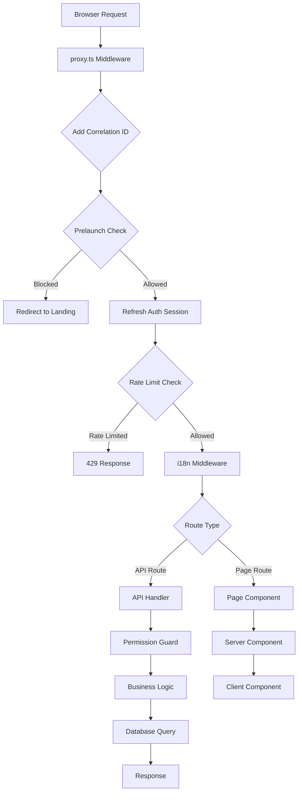

# Full Application Analysis & Cleanup Report

**Date:** 2025-01-27  
**Status:** Implementation In Progress

---

## Executive Summary

This document provides a comprehensive analysis of the Meen Ma3ana donation platform codebase, identifying deprecated code, proposing directory reorganization, and outlining cleanup strategies.

### Key Findings

- **Architecture:** Next.js 15 App Router with Supabase backend, Drizzle ORM, and comprehensive RBAC system
- **Deprecated Files:** 3 backup/comprehensive files identified
- **Test/Debug Routes:** Multiple test endpoints that should be archived
- **Scripts Organization:** 40+ scripts need better categorization
- **Code Quality:** Some TODO comments and deprecated patterns remain

---

## 1. Architecture Overview

### 1.1 Technology Stack

- **Frontend:** Next.js 15.5.6 (App Router), React 19.1.0, TypeScript 5.6.3
- **Backend:** Next.js API Routes, Supabase (Auth, Storage, Realtime)
- **Database:** PostgreSQL via Supabase, Drizzle ORM 0.44.4
- **Styling:** Tailwind CSS 4.1.16, Radix UI components
- **i18n:** next-intl 4.3.4 (English & Arabic)
- **Logging:** Pino 10.1.0 with correlation IDs

### 1.2 Request Flow Architecture



### 1.3 Directory Structure Analysis

**Current Structure:**
```
src/
├── app/                    # Next.js App Router
│   ├── [locale]/          # Localized routes
│   ├── api/               # API routes (backend)
│   └── (marketing)/       # Marketing pages
├── components/            # React components
│   ├── admin/            # Admin-specific
│   ├── auth/             # Auth components
│   ├── cases/            # Case-related
│   ├── ui/               # Reusable UI (shadcn)
│   └── marketing/        # Marketing components
├── lib/                   # Core libraries
│   ├── auth/            # Auth utilities
│   ├── rbac/            # RBAC system
│   ├── security/        # Security guards & RLS
│   ├── services/        # Business logic services
│   └── utils/           # Utilities
├── config/              # Configuration
└── types/               # TypeScript types
```

**Issues Identified:**
1. Mixed feature-specific and generic code in `lib/`
2. API routes not organized by feature domain
3. Scripts lack clear categorization
4. Test/debug routes mixed with production routes

---

## 2. Deprecated Code Identification

### 2.1 Backup Files

| File | Location | Status | Reason |
|------|----------|--------|--------|
| `route.backup.ts` | `src/app/api/contributions/` | Deprecated | Backup of old implementation |
| `route.comprehensive.ts` | `src/app/api/contributions/` | Deprecated | Alternative implementation not in use |

**Action:** Move to `src/app/api/contributions/Archived/`

### 2.2 Test/Debug Routes

These routes are protected by `ENABLE_TEST_ENDPOINTS` and `ENABLE_DEBUG_ENDPOINTS` flags but should be archived:

| Route | Location | Purpose |
|-------|----------|---------|
| `/api/test-rls` | `src/app/api/test-rls/` | RLS policy testing |
| `/api/test-storage` | `src/app/api/test-storage/` | Storage access testing |
| `/api/test-anonymization` | `src/app/api/test-anonymization/` | Data anonymization testing |
| `/api/test-db` | `src/app/api/test-db/` | Database connection testing |
| `/api/test-users` | `src/app/api/test-users/` | User testing |
| `/api/debug/*` | `src/app/api/debug/` | Debug endpoints (auth, cookies, guard, permission) |
| `/api/refresh-role` | `src/app/api/refresh-role/` | Role refresh utility |

**Action:** Move to `src/app/api/Archived/test/` and `src/app/api/Archived/debug/`

### 2.3 Deprecated Code Patterns

1. **Storage Buckets:** `CASE_IMAGES` bucket marked as deprecated in `src/lib/utils/storageBuckets.ts`
2. **CRUD Components:** `menuActions` prop deprecated in favor of new pattern in `DetailPageHeader.tsx` and `EditPageHeader.tsx`
3. **User Roles:** `VISITOR` role deprecated in `src/lib/admin/types.ts`

### 2.4 TODO/FIXME Items

**Critical TODOs:**
- Email service integration (`src/lib/notifications.ts:168`)
- Audit service implementation (`src/lib/services/auditService.ts:270, 296`)
- Background jobs notification sending (`src/lib/background-jobs.ts:60, 205`)

**Non-Critical TODOs:**
- Favorite functionality in cases pages
- Error toast notifications in components
- Local state updates in timeline components

---

## 3. Infrastructure & Configuration Analysis

### 3.1 Environment Configuration

**Current State:**
- Centralized in `src/config/env.ts` with Zod validation
- Some scripts still use direct `process.env` access
- Feature flags: `ENABLE_DEBUG_ENDPOINTS`, `ENABLE_TEST_ENDPOINTS`, `PRELAUNCH`

**Issues:**
- Inconsistent env access patterns across codebase
- Some scripts bypass centralized config

**Recommendation:** Migrate all scripts to use `src/config/env.ts` or create script-specific env loader

### 3.2 Scripts Organization

**Current Structure:** Flat directory with numbered prefixes

**Categories Identified:**
1. **Import Scripts (00-09):** Data import and migration
2. **Verification Scripts (10-19):** Data validation and checks
3. **Cleanup Scripts (20-29):** Data removal and deduplication
4. **Backfill Scripts (30-39):** Notification and data backfilling
5. **Role Assignment (40-49):** User role management
6. **Utilities (50-59):** General utilities
7. **Setup Scripts (60-69):** Infrastructure setup
8. **Admin Scripts (70-79):** Admin user management
9. **Maintenance (80+):** Ongoing maintenance tasks

**Proposed Reorganization:**
```
scripts/
├── import/              # Data import scripts
├── verification/        # Data validation
├── cleanup/            # Data cleanup (existing)
├── backfill/           # Data backfilling
├── admin/              # Admin utilities
├── setup/              # Infrastructure setup
├── maintenance/       # Ongoing maintenance
└── Archived/           # Deprecated scripts
```

### 3.3 API Route Patterns

**Current Patterns:**
- Mix of old-style (direct handlers) and new-style (api-wrapper)
- Inconsistent error handling
- Some routes use `createClient` directly, others use guards

**Standard Pattern (New):**
```typescript
import { createGetHandler, ApiHandlerContext } from '@/lib/utils/api-wrapper'
import { ApiError } from '@/lib/utils/api-errors'

async function handler(request: NextRequest, context: ApiHandlerContext) {
  const { supabase, logger, user } = context
  // Business logic
}

export const GET = createGetHandler(handler, { requireAuth: true })
```

**Migration Status:**
- ~19 routes migrated to new pattern
- ~30 routes still using old pattern
- Test/debug routes use old pattern (acceptable)

---

## 4. Proposed Directory Reorganization

### 4.1 API Routes Reorganization

**Current:** Flat structure under `src/app/api/`

**Proposed:**
```
src/app/api/
├── admin/              # Admin endpoints (keep as-is)
├── cases/              # Case management (keep as-is)
├── contributions/      # Contributions (keep as-is)
│   └── Archived/      # Backup files
├── beneficiaries/      # Beneficiaries (keep as-is)
├── profile/           # User profile (keep as-is)
├── notifications/     # Notifications (keep as-is)
├── landing/           # Landing page APIs (keep as-is)
├── Archived/          # Deprecated routes
│   ├── test/          # Test endpoints
│   └── debug/          # Debug endpoints
└── _lib/              # Shared API utilities (new)
```

### 4.2 Components Reorganization

**Current:** Feature-based organization (good)

**Proposed:** Minor improvements
```
src/components/
├── admin/             # Admin components (keep)
├── auth/              # Auth components (keep)
├── cases/             # Case components (keep)
├── contributions/      # Contribution components (keep)
├── ui/                # Reusable UI (keep)
├── marketing/         # Marketing components (keep)
└── Archived/          # Deprecated components (new)
```

### 4.3 Scripts Reorganization

**Proposed Structure:**
```
scripts/
├── import/
│   ├── 00-run-full-import.js
│   ├── 01-clear-all-data.js
│   ├── 02-import-contributions-with-users.js
│   └── 03-verify-import.js
├── verification/
│   ├── 10-check-extra-contributions.js
│   ├── 11-check-contribution-totals.js
│   └── 12-check-duplicate-contributions.js
├── cleanup/
│   ├── 20-remove-duplicate-contributions.js
│   └── replace-console-logs.js
├── backfill/
│   ├── 30-backfill-contribution-notifications.js
│   └── 31-backfill-donor-pending-notifications.js
├── admin/
│   ├── 40-assign-donor-role-to-all.js
│   ├── 41-assign-super-admin.js
│   ├── 70-admin-create-user.js
│   ├── 71-admin-add-user.js
│   └── 72-admin-seed-data.js
├── utilities/
│   ├── 50-utility-merge-contributors.js
│   └── 51-utility-recalculate-case-amounts.js
├── setup/
│   ├── 60-setup-storage-buckets.js
│   ├── 61-add-cases-menu-items.js
│   ├── 61-create-beneficiaries-bucket.js
│   ├── 62-verify-beneficiaries-bucket.js
│   ├── 63-verify-beneficiary-documents-rls.js
│   ├── setup-env.js
│   └── setup-admin-system.sh
├── maintenance/
│   └── 80-update-user-email-domains.js
├── i18n/              # Keep as-is
├── Archived/          # Deprecated scripts
└── dev.js             # Keep at root
```

---

## 5. Cleanup Plan

### 5.1 Phase 1: Archive Deprecated Files

1. **Create Archived directories:**
   - `src/app/api/contributions/Archived/`
   - `src/app/api/Archived/test/`
   - `src/app/api/Archived/debug/`
   - `src/components/Archived/`
   - `src/lib/Archived/`
   - `scripts/Archived/`

2. **Move backup files:**
   - `src/app/api/contributions/route.backup.ts` → `src/app/api/contributions/Archived/route.backup.ts`
   - `src/app/api/contributions/route.comprehensive.ts` → `src/app/api/contributions/Archived/route.comprehensive.ts`

3. **Move test/debug routes:**
   - All test routes → `src/app/api/Archived/test/`
   - All debug routes → `src/app/api/Archived/debug/`

### 5.2 Phase 2: Reorganize Scripts

1. Create new directory structure
2. Move scripts to appropriate categories
3. Update any script references in documentation
4. Keep numbered prefixes for backward compatibility

### 5.3 Phase 3: Code Cleanup

1. Remove or update deprecated code patterns
2. Address critical TODOs
3. Standardize API route patterns
4. Update documentation

### 5.4 Phase 4: Verification

1. Test all API routes after moves
2. Verify script functionality
3. Check for broken imports
4. Update documentation

---

## 6. Risk Assessment

### 6.1 Low Risk

- Moving backup files (not imported)
- Archiving test routes (protected by flags)
- Reorganizing scripts (internal use only)

### 6.2 Medium Risk

- Moving debug routes (may be used in development)
- Script reorganization (may break CI/CD if paths hardcoded)

### 6.3 Mitigation Strategies

1. **Git History:** All moves preserve history
2. **Gradual Migration:** Move in phases, test after each
3. **Documentation:** Update all references
4. **Rollback Plan:** Keep old structure until verification complete

---

## 7. Implementation Checklist

### Phase 1: Archive Deprecated Files
- [ ] Create Archived directories
- [ ] Move backup files
- [ ] Move test routes
- [ ] Move debug routes
- [ ] Verify no broken imports

### Phase 2: Reorganize Scripts
- [ ] Create new script directory structure
- [ ] Move scripts to categories
- [ ] Update script documentation
- [ ] Test script execution

### Phase 3: Code Cleanup
- [ ] Update deprecated patterns
- [ ] Address critical TODOs
- [ ] Standardize API routes
- [ ] Update type definitions

### Phase 4: Documentation & Verification
- [ ] Update architecture docs
- [ ] Update README files
- [ ] Test critical flows
- [ ] Verify build succeeds

---

## 8. Success Metrics

- ✅ All deprecated files archived
- ✅ Scripts organized by category
- ✅ No broken imports or references
- ✅ All tests pass
- ✅ Build succeeds
- ✅ Documentation updated

---

**Next Steps:** Begin Phase 1 implementation


